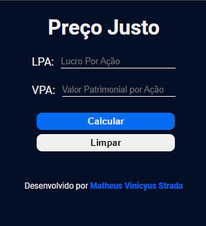

# Extesão Ação

## Índice

- [Overview](#overview)
  - [Screenshot](#screenshot)
- [Meu processo](#meu-processo)
  - [Construído com](#construído-com)
  - [Adicionando extensão](#adicionando-extensão)
  - [Recursos úteis](#recursos-úteis)
- [Autor](#autor)

## Overview

### Screenshot

## Meu processo

### Construído com

- Marcação HTML5 semântica
- Propriedades personalizadas CSS
- Script com JavaScript

### Adicionando extensão

### Recursos úteis

- [Docs Chrome](https://developer.chrome.com/docs/extensions/mv3/getstarted/) - Conceitos de desenvolvimento de extensão.

## Autor

- Website - [strada.dev.br](https://strada.dev.br)
- GitHub - [@zMatheus22](https://github.com/zMatheus22)
- LinkedIn - [@Matheus Vinicyus Strada](https://www.linkedin.com/in/matheus-vinicyus-strada/)
